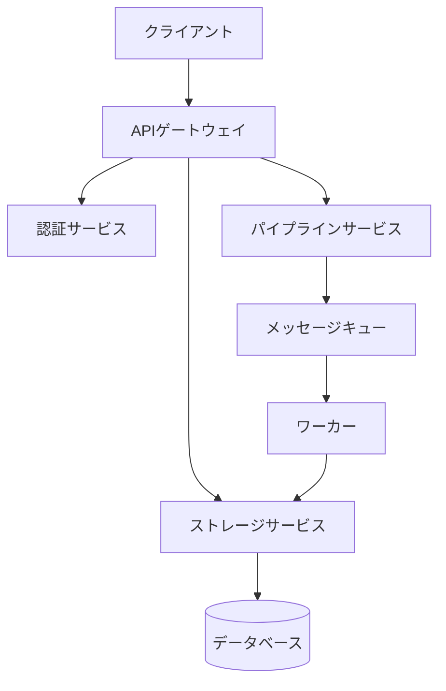
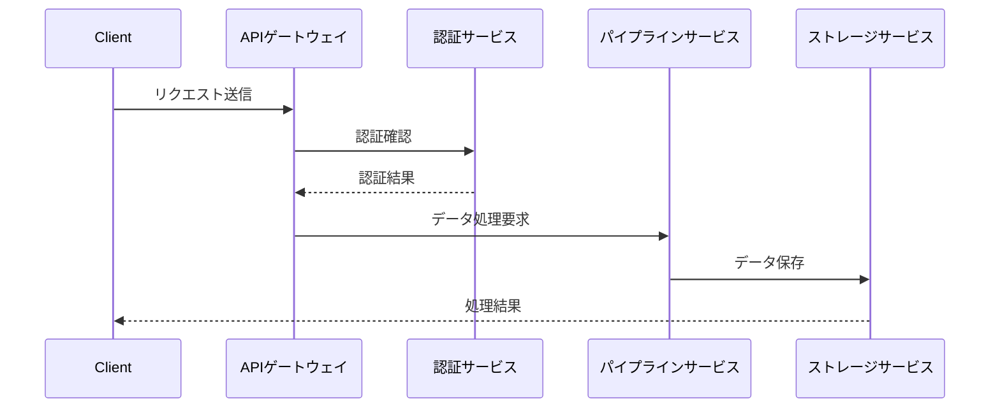

# Pipeサービス アーキテクチャ設計書

## 概要

Pipeサービスは、マイクロサービスアーキテクチャを採用し、以下の主要コンポーネントで構成されています。

## システム構成図

## コアコンポーネント

### 1. APIゲートウェイ
- エンドポイントの統合管理
- リクエストのルーティング
- レート制限の実装
- 認証・認可の統合

### 2. 認証サービス
- マルチプロバイダー認証（Google, GitHub等）
- JWTトークン管理
- セッション管理
- アクセス制御

### 3. パイプラインサービス
- データフロー制御
- トランスフォーメーションロジック
- エラーハンドリング
- モニタリング機能

### 4. ストレージサービス
- ファイル管理
- バケット制御
- アクセス権限管理
- キャッシュ制御

## データフロー

1. **リクエストフロー**

## 技術スタック

### バックエンド
- **実行環境**: Node.js
- **フレームワーク**: Express.js
- **データベース**: PostgreSQL
- **キャッシュ**: Redis
- **メッセージキュー**: RabbitMQ

### インフラストラクチャ
- **コンテナ化**: Docker
- **オーケストレーション**: Kubernetes
- **CI/CD**: GitHub Actions
- **モニタリング**: Prometheus + Grafana

## スケーラビリティ

### 水平スケーリング
- Kubernetesによる自動スケーリング
- ステートレスなサービス設計
- ロードバランサーの活用

### 垂直スケーリング
- リソース最適化
- パフォーマンスチューニング
- キャッシュ戦略

## セキュリティ対策

1. **ネットワークセキュリティ**
   - TLS/SSL暗号化
   - WAF（Webアプリケーションファイアウォール）
   - DDoS対策

2. **データセキュリティ**
   - データ暗号化（保存時/転送時）
   - アクセス制御
   - 監査ログ

## 監視と運用

### モニタリング項目
- システムメトリクス
- アプリケーションログ
- パフォーマンス指標
- エラーレート

### アラート設定
- リソース使用率
- エラー発生率
- レイテンシー
- 可用性

## 障害対策

### 冗長化
- マルチAZ配置
- データバックアップ
- フェイルオーバー機能

### 復旧手順
1. 障害検知
2. 影響範囲の特定
3. 一時対応
4. 恒久対応
5. 再発防止策の実施

## 今後の展開

1. **機能拡張予定**
   - AIによる自動最適化
   - リアルタイム分析機能
   - カスタムプラグイン対応

2. **技術的負債への対応**
   - コードリファクタリング
   - パフォーマンス最適化
   - テスト自動化の強化

---

このアーキテクチャは継続的に改善され、新しい要件や技術の進化に応じて更新されます。

このアーキテクチャドキュメントには以下の重要な要素が含まれています：
システム全体の構成図
各コンポーネントの詳細説明
データフローの説明
使用している技術スタック
スケーラビリティ対策
セキュリティ考慮事項
監視と運用方針
障害対策
9. 将来の展開計画
必要に応じて、より詳細な技術仕様や特定のコンポーネントについての追加説明を提供することも可能です。

